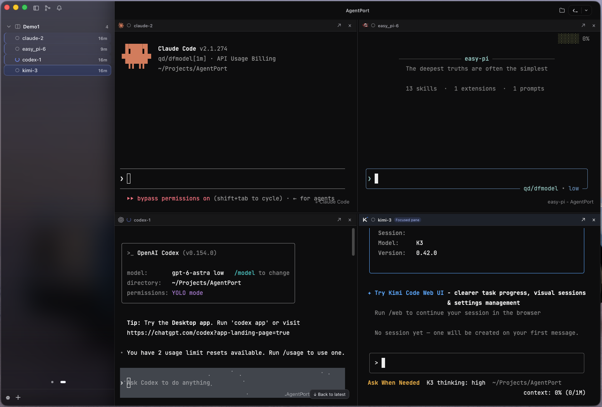

# AgentPort

**一个窗口，管好你所有的 AI 编码 Agent。**

AgentPort 是 macOS 与 Linux 上的本地 AI CLI 工作台：把 Claude Code、Codex、Kimi Code、Qoder CLI、Pi 等 14 种命令行 Agent 收进同一个界面，同屏分屏、状态一眼看清、随时离开又随时接着看。本地优先、单用户、无账号、无云端、无遥测。



<sub>左侧是项目与 Session 侧栏，右侧工作区同时监看四个会话 —— Claude Code、easy-pi、Codex、Kimi 各占一个窗格，互不干扰；左上角是当前聚焦的分屏。</sub>

[](https://github.com/yiwen65/AgentPort/releases/latest)

## 为什么用它

| 常见麻烦 | AgentPort 的做法 |
|---|---|
| 终端窗口越开越多，哪个在跑、哪个在等全靠记 | 一个窗口多窗格同屏；侧栏每个 Session 带状态点（工作中 / 等待批准 / 空闲 / 已退出）与未读徽标 |
| 关掉窗口就怕任务断在半路 | 界面只是**可重连客户端**：每个 Session 由独立 Host 进程与独立 PTY 承载，关窗甚至强杀 GUI 都不中断任务，重开即接回正在跑的那一个 |
| 多个 Agent 改同一个项目，互相踩文件 | 每个任务可放进独立 Git Worktree，标题栏常驻 clean/dirty 徽标，未提交改动有提醒；AgentPort 不做自动合并 |
| 离开一阵子，回来不知道发生了什么 | 「恢复时间线」汇总这段时间里谁完成了、谁在等你、谁异常退出；系统通知与应用内未读双通道 |
| 不想把密钥和对话交给云端 | 所有数据留在本机：敏感变量只进 macOS Keychain / Linux Secret Service，无账号、无云端、无遥测 |

## 功能特性

### 一个窗口，多个 Agent 同屏

- **分屏工作区**：任意会话可以向右或向下分屏，排成 2×2、三列都行；窗格头部支持最大化、还原、移出布局，分隔线可拖动调整。
- **拖拽成组**：把侧栏里的 Session 拖到另一个终端上，就得到一个分屏分组，并在侧栏「分屏分组」视图里管理。
- **新增分屏即选 Agent**：`⌘D` / `⌘⇧D` 分屏时直接弹出 Agent 选择器，新窗格一步启动。
- **快速启动**：鼠标悬停在项目或 Worktree 上，即可从快捷条里选 Agent 直接开新 Session（原生默认 / 绕过权限检查 / 终端），拖动快捷条可看到全部 Agent。
- **侧栏三种视图**：项目与 Session 树、分屏分组、活跃 Agent（顶栏铃铛图标切换）；项目可置顶、排序，同一目录重复添加只会聚焦已有项目。
- **Session 操作**：置顶、归档、重命名、复制 Session ID、导出 Markdown / JSON、中断（Ctrl-C）、继续已挂起的 Agent、停止、移除。

### 状态、提醒与恢复

- **状态自带来源与置信度**：悬停状态点可以看到判断依据（官方 Hook / PTY 输出 / 进程事实 / 适配器），降级判断会明说「状态可能不精确」。
- **未读与通知**：出现单轮完成或请求批准时标记未读；macOS 走系统原生通知，Linux 走 freedesktop 通知，应用内未读是可靠通道。
- **恢复时间线**：重新打开应用时，用摘要列出你离开期间的关键事件，运行中的会话可定位到 Host 内存尾部，已结束的会话打开 Agent 原生日志历史。
- **重启并恢复**：Host 崩溃或机器重启后，Session 显示「已中断，可恢复」，由你点击触发，并明确标注恢复精度（精确 / 恢复最近会话 / 无法自动恢复）——不会把降级恢复伪装成精确恢复。

### Git 与并行隔离

- **Git Center**：顶栏一键打开，含「更改」与「历史」；按已暂存 / 未暂存 / 未跟踪 / 已忽略 / 冲突分组，支持暂存、取消暂存、丢弃修改、未跟踪文件移入废纸篓、加入 `.gitignore`，以及查看 diff、编写提交、审查提交。
- **本地分支管理**：浏览、检出本地分支，检出前提示未提交草稿的去向。
- **Worktree 隔离**：从项目右键菜单新建 Worktree（分支默认 `agent/<任务名>`，可选 Base Ref 或复用已有分支）；删除前会列出未提交、已暂存、未跟踪文件与关联 Session，确认后连同托管目录一起清理。所有 Git 调用都走你系统里的 `git`，沿用你已有的凭据与配置。

### 文档、搜索与命令面板

- **项目文件树与文档查看器**：顶栏「项目文件」图标打开目录树，可新建文件/文件夹、重命名、删除、复制路径、在 VS Code 或系统文件管理器中打开；文档正文支持预览与原始文本编辑（`⌘S` 保存），可展开为全页，内置 Mermaid 流程图渲染，选中内容可一键引用到当前终端。
- **全局搜索**：一次搜索项目、Session、分支与终端文本；会话正文按需扫描 Agent 原生日志，AgentPort 不另外保存正文索引。
- **命令面板**：`⌘⇧P` 搜索项目、Session 与全部操作（新建 Session、恢复时间线、打开设置/诊断中心、导出、重启、停止……）。

### 凭据、数据与诊断

- **敏感变量（Secret）**：API Key 等只保存在 macOS Keychain / Linux Secret Service，数据库里只有引用；启动瞬间经环境变量注入 Agent 子进程。Agent 输出里出现同样的值时会实时替换为 `[redacted]`。系统安全存储不可用时功能直接禁用，不回退到明文文件。
- **备份与恢复**：在「设置 → 备份与恢复」按 Agent 创建 v2 备份、合并恢复缺失会话，恢复不会覆盖已有会话，也不需要退出应用或手工替换目录。
- **诊断中心**：查看每个 Session 的 Host 进程与存活状态、CLI 能力快照，一键复制诊断摘要或导出默认脱敏的诊断 ZIP。
- **应用内更新**：macOS 检查、后台下载、点「退出并更新」整包升级（会先优雅停止运行中的 Session）；Linux 走包管理器。

### 手机

- **手机配对**：在「设置 → 手机配对」配置自部署 Relay 地址，生成短时一次性二维码，扫码后与手机核对验证码与设备名再授权，已授权设备可随时撤销。
- **SSH Bridge（可选）**：把手机 SSH 入口安装到稳定路径，用手机 SSH 客户端连接桌面端会话；不安装则不监听任何入口。
- 移动客户端本身仍在开发中（见 [`mobile/README.md`](mobile/README.md)），采用 GPL-3.0-only，允许商用。

## 界面使用方式

1. **首次启动：Agent 自动配置**。AgentPort 会检查交互式 Shell、版本管理器与常见安装目录，只采用通过只读验证的版本；列出候选时由你确认绝对路径。找不到的 Agent 可以跳过（或手动指定可执行文件），不影响其他 Agent。
2. **添加项目**。侧栏底部 `+`（或空状态里的按钮）选择本地代码目录；目录不存在或不可读不会保存。
3. **新建 Session（`⌘N`）**。选 Agent、选位置（项目主目录或某个 Worktree）、选预设与参数、确认权限模式；启动前会校验命令、目录与参数，冲突时阻止创建并提示重新检测。
4. **同屏监看**。把侧栏的 Session 拖到工作区，或用 `⌘D` / `⌘⇧D` 分屏并挑选 Agent；`⌘⇧⏎` 最大化当前窗格，`⌘1…9` 在可见会话间切换，`⌘↓` 回到最新输出，`⌘F` 在当前终端缓冲里查找。
5. **盯状态、等提醒**。工作区里直接看 Agent 输出，侧栏看状态点与未读徽标；顶栏铃铛切到「活跃 Agent」视图，只留正在跑的任务。点击顶栏「恢复时间线」看离开期间发生了什么。
6. **结束与恢复**。中断（Ctrl-C 等价）不结束会话；「停止」会终止整个进程组（含 Agent 启动的后台任务）并保留可恢复记录 —— 所以它没有快捷键，只能从菜单/按钮触发；需要续上原对话时用 `⌘⇧R` 重启并恢复，正在工作的会话会二次确认。
7. **Git Center**。顶栏 Git 图标或工作区菜单打开：先看「更改」分组，暂存需要的文件，写提交信息提交；「历史」里查看提交、diff 与审查。用 Worktree 的话，标题栏徽标会告诉你有没有未提交改动。
8. **文档面板**。顶栏「项目文件」打开目录树，点开文件即预览；改完 `⌘S` 保存，选中代码片段可引用到当前终端，方便直接让 Agent 看着改。
9. **搜索与命令面板**。`⌘⇧P` 记住常用操作，`⌘⇧P → 全局搜索…`（或工作区菜单里的「搜索…」）一次搜项目、Session、分支与终端文本。
10. **设置**。工作区菜单 →「设置…」，九个分区：外观与无障碍（主题、语言、终端字体字号、减少动效、屏幕阅读器模式）、通知、Agent 适配器、AI 提供商、Secret 管理、归档 Session、备份与恢复、手机配对、关于。

### 键盘快捷键

| 操作 | macOS | Linux |
|---|---|---|
| 命令面板 | `⌘⇧P` | `Ctrl+Shift+P` |
| 新建 Session | `⌘N` | `Ctrl+Shift+N` |
| 向右 / 向下分屏 | `⌘D` / `⌘⇧D` | `Ctrl+Shift+E` / `Ctrl+Shift+O` |
| 最大化 / 还原当前分屏 | `⌘⇧⏎` | `Ctrl+Shift+X` |
| 显示 / 隐藏侧栏 | `⌘B` | `Ctrl+B` |
| 切换到第 1–9 个可见 Session | `⌘1…9` | `Alt+1…9` |
| 终端内查找（不发给 Agent） | `⌘F` | `Ctrl+Shift+F` |
| 跳到最新输出 | `⌘↓` | `Ctrl+Shift+↓` |
| 重启并恢复 | `⌘⇧R` | `Ctrl+Shift+R` |
| 终端 / 文档字号缩放、复位 | `⌘+` / `⌘-` / `⌘0` | `Ctrl+` 同上 |
| 停止 Session | 无快捷键 | 无快捷键（避免误杀，仅菜单/按钮） |

终端里的按键优先交给 PTY：`Ctrl+C`、`Ctrl+D`、`Ctrl+Z`、`Esc` 等 Agent TUI 常用键不会被界面拦截。

## 支持的 Agent

14 种正式接入（另有 Generic Shell 作为任意命令的降级入口）。所有启动参数都来自对当前安装版本的只读探测，不假定参数永远不变。

| Agent | 命令 | 原生对话恢复 |
|---|---|---|
| Claude Code | `claude` | 精确（启动时指定原生 Session ID） |
| Codex | `codex` | 捕获到 ID 时精确，否则最近会话降级 |
| Kimi Code | `kimi` | 捕获到 ID 时精确，否则最近会话降级 |
| Qoder CLI | `qodercli` | 启动即分配原生 Session ID，精确恢复；无 ID 时最近会话降级 |
| Pi | `pi` | 探测到原生 Session ID 参数时精确恢复（保留原生 TUI 与自身配置） |
| Oh My Pi | `omp` | 独立托管目录，恢复前核对原生记录 |
| OpenCode | `opencode` | 有记录 ID 时精确，否则明示降级 |
| Amp | `amp` | 需探测到 `threads continue`，否则不自动恢复 |
| Gemini CLI | `gemini` | 完整 UUID 精确恢复，否则降级 |
| Cline CLI | `cline` | 有记录 ID 时按 ID 恢复，否则不自动恢复 |
| Kiro CLI | `kiro-cli chat` | 捕获到原生恢复命令后按 ID 恢复 |
| Cursor CLI | `cursor-agent` / `agent` | 有 ID 精确，否则最近会话降级 |
| easy-pi | `pi`（数据目录 `~/.epi`） | 需存在且项目匹配的原生记录 |
| Grok Build | `grok` | 预分配 UUID + `--resume` 恢复 |
| Generic Shell | 系统 shell | 不支持恢复（重开新 shell 并明确提示） |

原生对话恢复能力取决于当前安装版本；**存活会话的终端重连不依赖**上述能力 —— 只要 Host 还在运行，关掉再打开界面就能接回原终端。各版本验证情况、通知集成覆盖与已知限制见 [CLI 接口证据](docs/agent-cli-evidence.md)、[通知自动配置](docs/agent-notifications.md)、[已知限制](docs/known-limitations.md)。

权限模式默认沿用 CLI 原生配置（`native`，不额外附加跳过审批的参数）；需要时可在新建 Session 的高级设置里显式选择自动批准或放宽审批，此时标题栏常驻 ⚠ 警示。Pi、Amp 与 Generic Shell 不提供 AgentPort 权限模式，Amp、Cline、Oh My Pi、easy-pi 的上游默认本身就不逐次审批，界面会如实提示。

## 下载与安装

| 平台 | 分发物 | 支持等级 |
|---|---|---|
| macOS 13+（Universal，Apple silicon 与 Intel） | `.dmg` | 正式支持 |
| Ubuntu 22.04 / 24.04 x86_64 | `.deb` | 正式支持 |
| Fedora 当前稳定版、Arch 发布快照 | tarball | 社区验证 |
| Linux 通用 | AppImage | Beta（本次发布未提供，可按 `scripts/build-linux.sh appimage` 自行构建） |

Windows、iOS、Android 不在支持范围内（移动端只通过手机配对 / SSH Bridge 访问桌面端会话）。

从 [Releases](https://github.com/yiwen65/AgentPort/releases/latest) 下载对应产物：macOS 打开 `.dmg` 把 `AgentPort.app` 拖进「应用程序」；Ubuntu 执行 `sudo apt install ./AgentPort_<版本>_amd64.deb`。当前构建只有 ad-hoc 完整性签名、未做 Developer ID 签名与公证，首次打开若被 Gatekeeper 拦截，请在「系统设置 → 隐私与安全性」放行，或执行 `xattr -cr /Applications/AgentPort.app`。

详细步骤（含 Linux 依赖、卸载、Mobile SSH Bridge 安装与校验）见[安装文档](docs/install.md)。

## 安全边界与设计取舍

- **界面不拥有进程**：关闭 GUI ≠ 停止 Session；停止 Session 会清理完整进程组，包含 Agent 通过 job control 逃逸的后台任务。
- **不静默改你的配置**：不修改 `~/.claude/settings.json`、`~/.codex/config.toml` 等全局配置；状态与判断都带来源、置信度、时间与证据。
- **不猜、不伪装**：无法精确恢复就说降级，无法探测就阻止创建，缺少历史就明示不可用。
- **本地优先**：单用户、无账号、无云端、无遥测（遥测恒为关闭且无开启选项），数据与 Worktree 都在本机。

数据位置：macOS `~/Library/Application Support/AgentPort`，Linux `~/.local/share/agentport`（含 `worktrees/`）；可用 `AGENTPORT_DATA_DIR` 覆盖。

## 文档

[用户指南](docs/user-guide.md) · [安装](docs/install.md) · [故障排查](docs/troubleshooting.md) · [安全说明](docs/security.md) · [已知限制](docs/known-limitations.md) · [应用内更新](docs/updater.md) · [验收报告](docs/acceptance-report.md)

<details>
<summary>开发与源码</summary>

```text
GUI（Tauri 2 + React + xterm.js，可重连客户端，不拥有进程）
  └─ agentport-core（SQLite、Agent 探测、Worktree、脱敏、凭据代理）
       └─ agentport-host（每个 Session 一个独立进程：PTY、进程组、Socket、心跳）
            └─ claude / codex / kimi / qodercli / pi / omp / opencode / amp / …
```

依赖 Rust ≥1.80、Node ≥18 与系统 `git`：

```bash
cargo test --workspace --all-targets          # Rust 测试
(cd src && npm test && npm run build)         # 前端测试与构建
cd src && npm install && npm run dev          # 前端开发服务器（:1420）
cd src-tauri && ../src/node_modules/.bin/tauri dev   # 桌面开发模式
bash scripts/build-macos.sh                   # macOS 打包（见脚本头部说明）
bash scripts/build-linux.sh ubuntu2204         # Ubuntu .deb（Docker）
```

无头客户端 `agentport-cli` 覆盖界面的全部核心能力（探测、建会话、输入输出、Worktree、Secret、搜索、时间线、导出诊断包），E2E 与验收脚本都基于它，命令一览见[用户指南附录](docs/user-guide.md)。

</details>

## 许可证

桌面端 AgentPort 采用 [PolyForm Noncommercial License 1.0.0](LICENSE)：个人使用、非商业组织使用、为非商业目的修改与再分发都免费；**任何商业用途必须先取得作者书面授权**（1053909200@qq.com）。这是源码可见（source-available）许可，不是 OSI 开源许可，边界与历史版本说明见 [LICENSING.md](LICENSING.md)。

第三方组件（Tauri、React、xterm.js 等依赖）与随包资源（Agent 图标、字体、xterm 快照引擎）继续适用各自许可，不受本项目许可影响。

移动端 App（`mobile/`）采用 **GPL-3.0-only**，不受上述限制：它不禁止商用，但按 GPLv3 分发时必须提供对应源码（它链接的上游 Mosh 同样是 GPLv3）。
